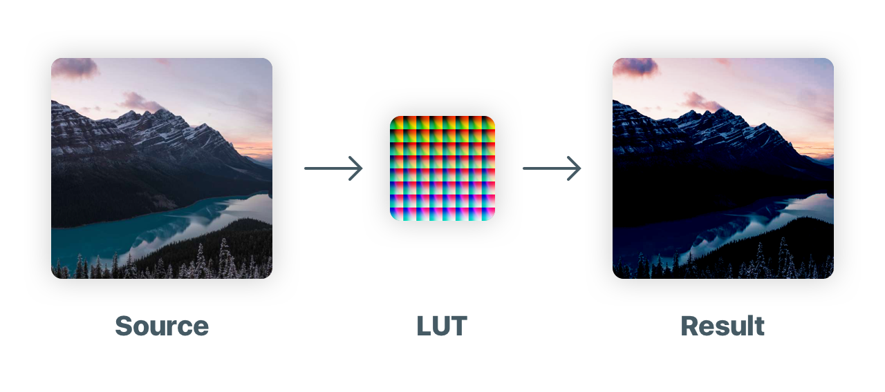

# ColorCube 

## Updated 2021-03-24

Better solution which renders image with correct coloring.
https://www.notion.so/muukii/CoreImage-How-to-create-cube-data-from-LUT-Image-for-CIColorCube-CIColorCubeWithColorSpace-9e554fd418e8463abb25d6232613ac1c

---

  

Create CubeData for CIColorCube from LUT image.

## Usage

// TODO:

## Author

muukii, m@muukii.me

## License

ColorCube is available under the MIT license. See the LICENSE file for more info.

